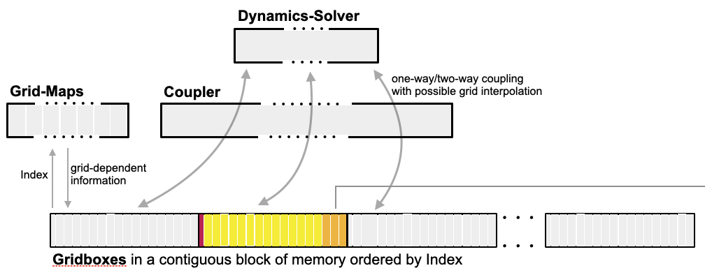
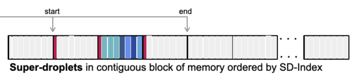
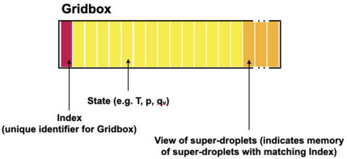
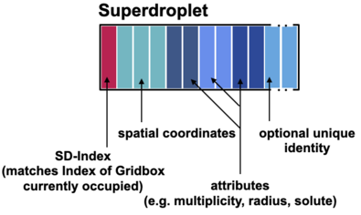

Memory Layout
=============

The key structures which compose CLEO and their memory layout are shown schematically below.

   A schematic for memory layout of CLEO's key structures. The superdroplets follow on
   in the bottom panel from the right-hand side of the figure above.

Each node of a computer allocated to the program contains a portion of the simulated domain
that is composed of gridboxes. The gridboxes exist in a contigous block of memory (managed
by a Kokkos view-like type) and each gridbox exchanges information about its dynamical
state (thermodynamics and wind velocity) with "Dynamics-Solver" via a "Coupler". The "Dynamics-Solver"
and "Coupler" are abstract ideas (i.e. they are C++ concepts for constraining templated types), but
get instantiated at compilation, for example as `ICON <https://www.icon-model.org>`_ and
`YAC <https://dkrz-sw.gitlab-pages.dkrz.de/yac/index.html>`_ respectively.

Each gridbox is composed of certain elements:

   Schematic showing the elements of a gridbox in CLEO

For reasons of computational efficiency, superdroplets are not stored within gridboxes. Instead all
the superdroplets whose positions lie within the portion of the domain on that node at a given timestep
are stored in another distinct contigous block of memory (also managed by a
Kokkos view-like type) and that block is ordered by the gridbox each superdroplet is associated with
(i.e. the superdroplets are ordered based on their location in the domain). Each gridbox then
contains a pointer-like object which identifies another contigous block of memory,
seperate from the gridboxes, that contains the superdroplets associated with that particular gridbox
at a given timestep.

Every superdroplet has spatial coordinates and an index which identifies which gridbox those
coordinates lie within. Furthermore the superdroplet has attributes which defines what "real"
droplet it represents (e.g. the superdroplet may have the attributes to define its radius and
multiplicity). Additionally, to aid analysis involving Lagrangian particle tracking, each superdroplet
can optionally be given a unique identifier. This is illustrated in the schematic below.

   Schematic showing the elements of a superdroplet in CLEO
